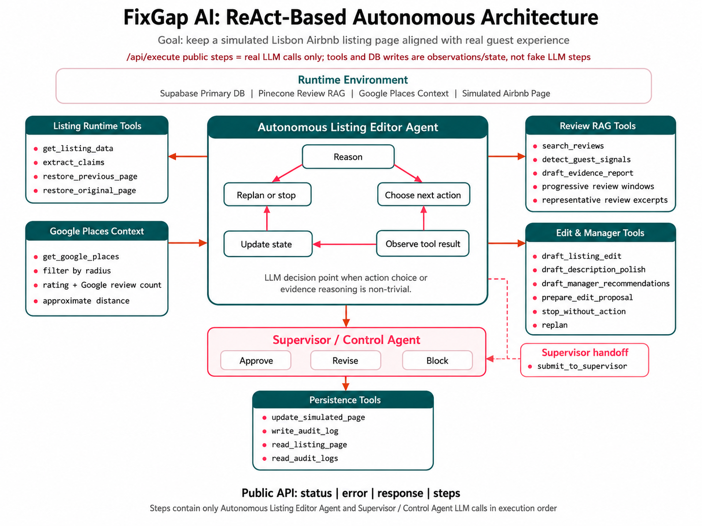

<p align="center">
  <a href="https://drive.google.com/file/d/19gj8hQShXqdnhYH7rVQFDOyaZtzfOImp/view?usp=sharing">
    
  </a>
  
  
  
  
  
  
  
  
</p>

# FixGap AI

**Autonomous Lisbon Airbnb Listing Editor**

FixGap AI is an autonomous AI agent that helps Lisbon short-term-rental managers keep simulated Airbnb listing pages aligned with what guests actually experience. It reads the current listing page, searches Airbnb guest-review evidence, uses nearby Google Places context when useful, and decides whether a page improvement is justified.

Instead of following a fixed workflow, the agent chooses actions dynamically. It may search more reviews, inspect nearby places, draft a safer listing edit, recommend property fixes, polish existing copy, restore a previous version, or stop without editing when evidence is not strong enough.

&#127916; Watch the [demo video](https://drive.google.com/file/d/19gj8hQShXqdnhYH7rVQFDOyaZtzfOImp/view?usp=sharing) for a quick walkthrough of how to use the agent, run end-to-end improvements, and inspect its execution trace.

Supabase is the primary runtime database. Approved simulated listing-page updates and audit logs are written to Supabase. For a clean product demo, a new browser session resets the selected listing page to the source dataset before the first agent run, and the explicit `Reset Page` control can restore listing state at any time.

## &#128161; What It Does

- &#128269; **Improves listing copy end to end** by comparing the simulated page against guest-review evidence and nearby context, then updating only the fields that are safe and useful to improve.
- &#129517; **Finds review-backed expectation gaps** such as stairs, compact rooms, noise, temperature comfort, cleanliness, views, location strengths, walkability, and nearby value.
- &#128205; **Turns nearby context into guest-facing value** when Google Places provides strong supporting facts such as place name, rating, Google review count, category, and approximate distance.
- &#128736; **Recommends property and operations fixes** from repeated guest complaints, helping the manager decide what to improve first without changing the public listing text.
- &#128221; **Polishes existing listing language** when the user asks for copy improvement only, preserving current facts while making the page sound clearer and more natural.
- &#8617; **Restores previous versions** when the manager dislikes a simulated edit, keeping the demo workflow easy to inspect and reverse.
- &#128721; **Stops autonomously** when the next edit is weak, redundant, unsafe, or not supported by enough evidence.

## &#9881; How It Works

The main agent follows a ReAct-style loop:

```text
Reason -> Choose Tool -> Observe -> Update State -> Replan or Stop
```

`Autonomous Listing Editor Agent` receives a property-manager request, chooses relevant tools dynamically, observes evidence, updates its state, and decides whether to draft an edit, ask for more evidence, stop without action, or submit a proposal.

`Supervisor / Control Agent` reviews proposed page updates before execution. It can approve, revise, or block an action, so the agent can complete end-to-end tasks while keeping edits narrow, evidence-backed, and inside the simulated page boundary.

### &#128200; Progressive Review Coverage

Some Lisbon listings include hundreds or thousands of guest-review texts. FixGap AI does not blindly push every review into one prompt. It retrieves focused evidence windows, updates its state, and decides whether the current evidence is enough for a useful edit.

If the same end-to-end request is run again in the same demo session, the agent continues from the next review-coverage window instead of reusing only the same sample. This allows it to discover additional gaps over repeated runs, while still stopping when the current page already covers the strongest supported topics or when no safe new edit remains.

## &#127970; Architecture



## &#128202; Data & Evidence

- **50 final Lisbon listings** selected for richer Airbnb review coverage and nearby-place context.
- **Airbnb guest reviews** are the primary evidence source and are retrieved through Pinecone RAG.
- **Google Places** provides supporting environmental context such as nearby place names, ratings, review counts, categories, and approximate distance.
- **Listing page state and audit logs** persist in Supabase during production runtime.
- **Supervisor-approved edits** are recorded with an audit trail so each visible page change can be traced back to an autonomous decision.

## &#128640; Production Stack

Production runs with live LLMod.ai decision calls for the Agent and Supervisor modules.

| Layer | Technology |
| --- | --- |
| Application | Next.js / TypeScript |
| Text model | `MB5R2CF-azure/gpt-5.4-mini` |
| LLM provider | LLMod.ai |
| Embeddings | `MB5R2CF-azure/text-embedding-3-small` |
| Primary database | Supabase |
| Vector database | Pinecone |
| Deployment | Vercel |

## &#128279; Required Project API

```text
GET  /api/team_info
GET  /api/agent_info
GET  /api/model_architecture
POST /api/execute
```

`POST /api/execute` accepts:

```json
{
  "prompt": "User request here"
}
```

Success response:

```json
{
  "status": "ok",
  "error": null,
  "response": "...",
  "steps": []
}
```

Error response:

```json
{
  "status": "error",
  "error": "Human-readable error description",
  "response": null,
  "steps": []
}
```

`steps` contains the real LLM calls executed by the agent in order, as required by the course API specification. Each step includes the module name, the effective prompt sent to the model, and the parsed model response.

## &#128737; Safety & Scope

FixGap AI is intentionally scoped to a simulated listing-management environment. It does not access a live Airbnb account, scrape websites, change prices or bookings, respond to private messages, or edit guest reviews. Updates occur only in the simulated demo listing page, and unsupported amenities or invented claims are blocked before execution.

## &#128187; Local Development

```bash
npm install
npm run dev
```

Local development supports an optional mock LLM mode for testing without external model calls.
