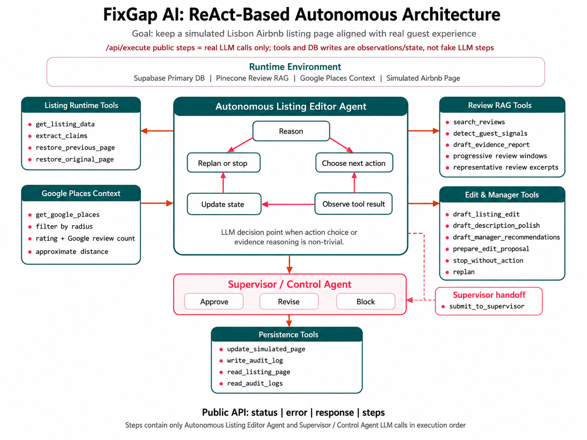

<p align="center">
  
  
  
  
  
  
</p>

# FixGap AI

**Evidence-backed Airbnb property assessments for guests and listing improvements for owners.**

FixGap AI examines a prepared Lisbon Airbnb dataset and guest reviews. It reuses an existing Pinecone review index for semantic retrieval, compares review evidence with the listing, and adds relevant nearby-place context from cached Google Maps-style records in Supabase. Gemini reasons over selected evidence; deterministic checks enforce source provenance, schema, and edit safety. The app never edits a real Airbnb account.

&#127916; [Watch the project walkthrough](https://drive.google.com/file/d/19gj8hQShXqdnhYH7rVQFDOyaZtzfOImp/view?usp=sharing). The recording may show an earlier interface; the current app has separate Guest and Owner agents.

## Two Agents

### Guest Agent

For someone considering a property, the Guest Agent produces a concise Hebrew assessment: supported strengths and drawbacks, listing-versus-review gaps, guest fit, questions to check before booking, and a neighborhood summary. Findings link to exact guest-review quotations. Nearby venue reviews are kept separate from reviews of the property.

Each click analyzes the next source window of up to 200 usable reviews. Pinecone searches by existing review vector ID cover strengths, drawbacks, mixed experiences, and broad discovery within that window. Only selected passages enter the model context; the result is not an exhaustive or representative analysis of all guests. An update adds supporting, contradicting, or contextual evidence without replacing the original findings. A deterministic provenance check and semantic supervisor must approve every assessment.

In production, a signed, short-lived continuation token carries the verified report between requests so updates do not depend on a particular Vercel function instance. Refreshing the page starts a new browser session.

### Owner Agent

The Owner Agent compares the current simulated listing page with guest experience and optional nearby context. Its ReAct-style loop can inspect reviews, draft a complete Hebrew About replacement, request supervision, execute an approved edit, or stop when no useful new gap is justified. A separate **Find property fixes** request returns prioritized operational recommendations without editing the page.

End-to-end review runs advance through one new source window of up to 240 reviews per request. Semantic retrieval reuses the existing Pinecone vectors; compact evidence and a sample of source reviews allow the model to propose additional dynamic signals. Code checks review IDs and claims before a proposed edit reaches the supervisor. A new window does not automatically mean a new edit.

Only the simulated page is changed. Production page state and audit logs use Supabase; local development blocks Supabase writes. The public Owner trace lists actual LLM calls, not deterministic tool observations mislabeled as model steps.

## Architecture

```text
Prepared Airbnb listing + review source       Cached nearby places in Supabase
                 |                                         |
                 +----> Pinecone review retrieval <--------+
                                   |
                       Compact, attributable evidence
                                   |
                         Guest or Owner reasoning
                                   |
                    Schema and provenance validation
                                   |
                         Semantic supervision
                                   |
             Guest report / approved simulated page edit
```

The original Owner architecture overview is retained below. The Guest Agent follows the separate supervised assessment pipeline described above, not the Owner's ReAct edit loop.



## Data Boundaries

- **Airbnb source data:** prepared Lisbon listings and reviews included with the project. Listing availability and property conditions are not verified live.
- **Review RAG:** the existing Pinecone `airbnb-reviews` index, namespace `airbnb-reviews-rich-50`. Searches reuse stored vectors; runtime does not create embeddings or upsert reviews.
- **Nearby context:** cached Google Maps-style place records in Supabase, including category, rating, Google review count, and straight-line distance. The app does not call the live Google Places API.
- **LLM:** Gemini for evidence reasoning and semantic supervision. JSON/schema, source quotations, review IDs, and unsupported claims are checked in code.
- **Writes:** Guest assessments do not edit listings. Owner edits affect only the simulated page after supervisor approval; no live Airbnb account, booking, price, private message, or guest review is modified.

## Local Setup

```bash
npm install
cp .env.example .env.local
npm run dev
```

Set `GEMINI_API_KEY`, `PINECONE_API_KEY`, `SUPABASE_URL`, and `SUPABASE_SERVICE_ROLE_KEY` in `.env.local`. Use `LLM_PROVIDER=gemini`, `LLM_MODE=live`, `PINECONE_REVIEW_INDEX=airbnb-reviews`, and `PINECONE_REVIEW_NAMESPACE=airbnb-reviews-rich-50`. Set `FIXGAP_LOCAL_ONLY=true` to prevent local Supabase page and audit writes. Do not commit `.env.local` or share service-role credentials.

Run focused checks with `node scripts/qa-local.mjs` and a production build with `npm run build`. The QA script mocks external services; it does not spend model tokens.

## Deployment

The GitHub `main` branch is connected to Vercel. Configure the same Gemini, Pinecone, and Supabase credentials as **server-side Production environment variables**, along with `LLM_PROVIDER=gemini`, `LLM_MODE=live`, `LLM_LIVE_MODULES=agent,supervisor`, `REQUIRE_PINECONE_RAG=true`, and `REQUIRE_SUPABASE_RUNTIME=true`. Do not set `FIXGAP_LOCAL_ONLY=true` in production. The Supabase schema is in [`supabase/schema.sql`](supabase/schema.sql).

The production Guest continuation is signed server-side using `GUEST_SESSION_SECRET`, or the already configured Supabase service-role key when a dedicated signing secret is absent. Neither key is sent to the browser. The signed token contains review evidence already returned by the assessment API; it expires after two hours and is scoped to the selected property and browser session.

## API

```text
GET  /api/team_info
GET  /api/agent_info
GET  /api/model_architecture
POST /api/execute             Owner Agent
GET  /api/guest_assessment    Current local session result
POST /api/guest_assessment    Guest assessment or next window
```

`POST /api/execute` accepts a `prompt`, optional `session_id`, and optional `review_coverage_state`. It returns `status`, `error`, `response`, real LLM `steps`, and the updated coverage state when available. `POST /api/guest_assessment` accepts `listing_id` and `session_id`; production update requests also send back the signed `continuation` returned by the previous successful response.

This is a portfolio research demo, not a booking recommendation or a live property inspection. Review evidence is a selected sample and may be historical.
